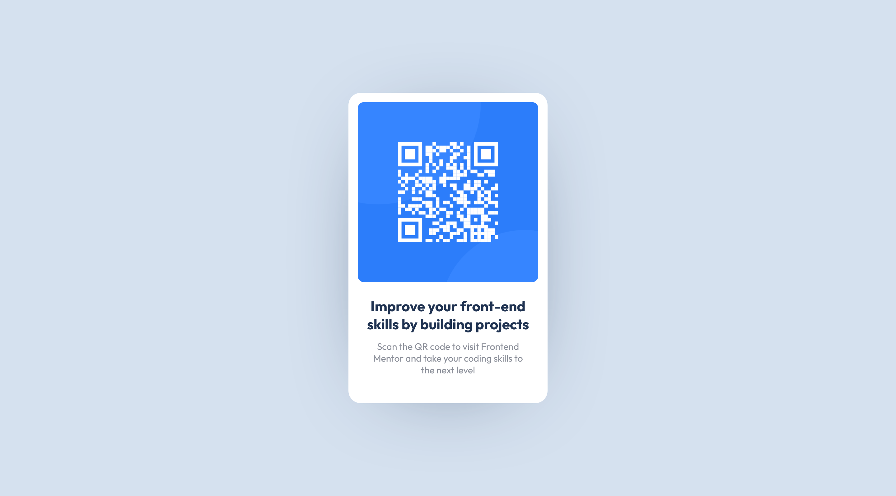

# Frontend Mentor - QR code component solution

This is a solution to the [QR code component challenge on Frontend Mentor](https://www.frontendmentor.io/challenges/qr-code-component-iux_sIO_H). Frontend Mentor challenges help you improve your coding skills by building realistic projects. 

## Table of contents

- [Overview](#overview)
  - [Screenshot](#screenshot)
  - [Links](#links)
- [My process](#my-process)
  - [Built with](#built-with)
  - [What I learned](#what-i-learned)
  - [Useful resources](#useful-resources)
- [Author](#author)

## Overview

### Screenshot

### Links

- Solution URL: [Add solution URL here](https://your-solution-url.com)
- Live Site URL: [https://kamilkwk12.github.io/QR-code-component/](https://kamilkwk12.github.io/QR-code-component/)

## My process
  Firstly I created a container for main element, edited background color of whole site, background color for the container and its shadow. Secondly I added image of QR Code, header text and paragraph to the container. Rest of work was to edit these element properly, so the whole site look nearly identical to the first design.

### Built with

- HTML5 markup
- CSS custom properties
- Flexbox

### What I learned

I've learned basic usage of flexbox to achive better responive design of the website. Still much work to learn about it but I think it's a good start for me.

### Useful resources

- [W3Schools](https://www.w3schools.com/css/) - I use this website a lot. It can really help with some simple, beginner problems, and tutorials to basics of front-end languages are clear and understandable.

## Author

- Frontend Mentor - [@@Kamilkwk12](https://www.frontendmentor.io/profile/Kamilkwk12)

